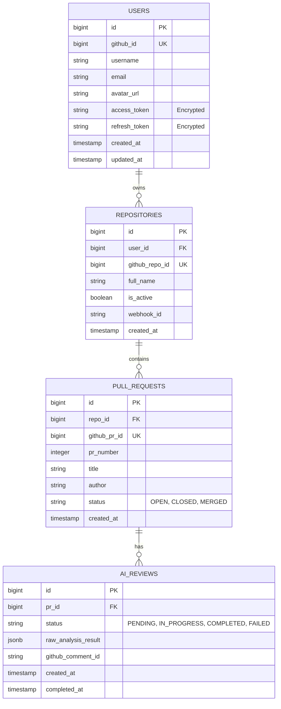

# Database Schema Design - Code Review Agent

## 1. Overview

이 서비스는 PostgreSQL을 기본 데이터베이스로 사용하며, AI 리뷰 결과와 같이 정형화되지 않은 데이터는 `JSONB` 타입을 활용합니다.

## 2. ER Diagram

## 3. Table Details

### 3.1. `users`

사용자 계정 및 GitHub OAuth 인증 정보를 관리합니다.

- `access_token` 및 `refresh_token`은 보안을 위해 반드시 암호화하여 저장합니다.

| Column        | Type         | Constraints      | Description                     |
| :------------ | :----------- | :--------------- | :------------------------------ |
| id            | BIGINT       | PRIMARY KEY      | 내부 식별자                     |
| github_id     | BIGINT       | UNIQUE, NOT NULL | GitHub 고유 ID                  |
| username      | VARCHAR(255) | NOT NULL         | GitHub 사용자명                 |
| email         | VARCHAR(255) |                  | 사용자 이메일                   |
| avatar_url    | TEXT         |                  | GitHub 프로필 이미지 URL        |
| access_token  | TEXT         | NOT NULL         | OAuth Access Token (Encrypted)  |
| refresh_token | TEXT         |                  | OAuth Refresh Token (Encrypted) |
| created_at    | TIMESTAMP    | DEFAULT NOW()    | 생성 일시                       |
| updated_at    | TIMESTAMP    | DEFAULT NOW()    | 수정 일시                       |

### 3.2. `repositories`

사용자가 연동한 GitHub 레포지토리 정보를 저장합니다.

| Column         | Type         | Constraints      | Description                     |
| :------------- | :----------- | :--------------- | :------------------------------ |
| id             | BIGINT       | PRIMARY KEY      | 내부 식별자                     |
| user_id        | BIGINT       | FOREIGN KEY      | `users.id` 참조                 |
| github_repo_id | BIGINT       | UNIQUE, NOT NULL | GitHub 레포지토리 ID            |
| full_name      | VARCHAR(255) | NOT NULL         | 레포지토리 풀 네임 (owner/repo) |
| is_active      | BOOLEAN      | DEFAULT FALSE    | 리뷰 활성화 여부                |
| webhook_id     | VARCHAR(255) |                  | GitHub에 등록된 Webhook ID      |
| created_at     | TIMESTAMP    | DEFAULT NOW()    | 연동 일시                       |

### 3.3. `pull_requests`

분석 대상이 되는 Pull Request 정보를 관리합니다.

| Column       | Type         | Constraints      | Description                    |
| :----------- | :----------- | :--------------- | :----------------------------- |
| id           | BIGINT       | PRIMARY KEY      | 내부 식별자                    |
| repo_id      | BIGINT       | FOREIGN KEY      | `repositories.id` 참조         |
| github_pr_id | BIGINT       | UNIQUE, NOT NULL | GitHub PR ID                   |
| pr_number    | INTEGER      | NOT NULL         | PR 번호                        |
| title        | TEXT         |                  | PR 제목                        |
| author       | VARCHAR(255) |                  | PR 작성자                      |
| status       | VARCHAR(50)  |                  | PR 상태 (OPEN, CLOSED, MERGED) |
| created_at   | TIMESTAMP    | DEFAULT NOW()    | PR 생성 일시                   |

### 3.4. `ai_reviews`

AI가 수행한 코드 리뷰 결과 및 상태를 저장합니다.

| Column              | Type         | Constraints   | Description                            |
| :------------------ | :----------- | :------------ | :------------------------------------- |
| id                  | BIGINT       | PRIMARY KEY   | 내부 식별자                            |
| pr_id               | BIGINT       | FOREIGN KEY   | `pull_requests.id` 참조                |
| status              | VARCHAR(50)  | NOT NULL      | 리뷰 상태 (PENDING, IN_PROGRESS, etc.) |
| raw_analysis_result | JSONB        |               | AI가 반환한 원본 분석 데이터           |
| github_comment_id   | VARCHAR(255) |               | GitHub에 작성된 코멘트 ID              |
| created_at          | TIMESTAMP    | DEFAULT NOW() | 요청 일시                              |
| completed_at        | TIMESTAMP    |               | 완료 일시                              |
